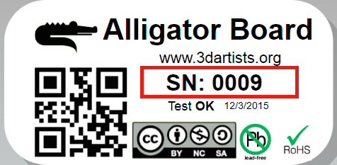

# Alligator-Arduino-variant

*Variant files to add support of Alligator Board in your arduino IDE Software*

### Instruction

1. Install **Arduino 1.6.6** or **Arduino 1.6.7**
2. Open Arduino Software and navigate to **Arduino -> Preferences** 
   - add Alligator package link in the **Additional Board Manager URL** 
   - http://www.chew-z.it/download/alligator/package_Alligator_r2_index.json
   - 
3. Open **Tools -> Board -> Board Manager**
   - 
4. Install the **Alligator 3D Artists Package**
   - 
5. Select Alligator Board: 

  **Tools -> Board -> Alligator 3D Printer Board R2 (USB/UART) or (NATIVE/USB)**
  
6. **ERASE** flash memory and upload code
 
  Uploading code to the SAM3X is different than the AVR microcontrollers found in other boards because the flash memory   needs to be erased before being re-programmed. Upload to the chip is managed by ROM on the SAM3X, which is run only when the chip's flash memory is empty.

  *This procedure is only required for the UART port, the NATIVE port has automatic erase flash functions via usb*

  The dip switch near the processor is responsable for the manual flash erase procedure :

    - Dip switch toward drivers engine
    - Press the reset button
    - Waiting for 1 second
    - Dip-switch toward processor
    - Press the reset button
    - upload code

  
**WARNING only for Alligator SN less than #77 : Native port are directly connected to 5V power !**  
**Do not connect Native USB port to the PC in presence of 12-24V power input.**  
**Communicate with Alligator and with your printer only from the USB/UART port.**  
**Native port connected directly to the PC can be used only for board testing without 12-24V power input**
 
    - How To Find **SN** ?
    
    Serial Number label is located on the bottom of the board:
    
    
